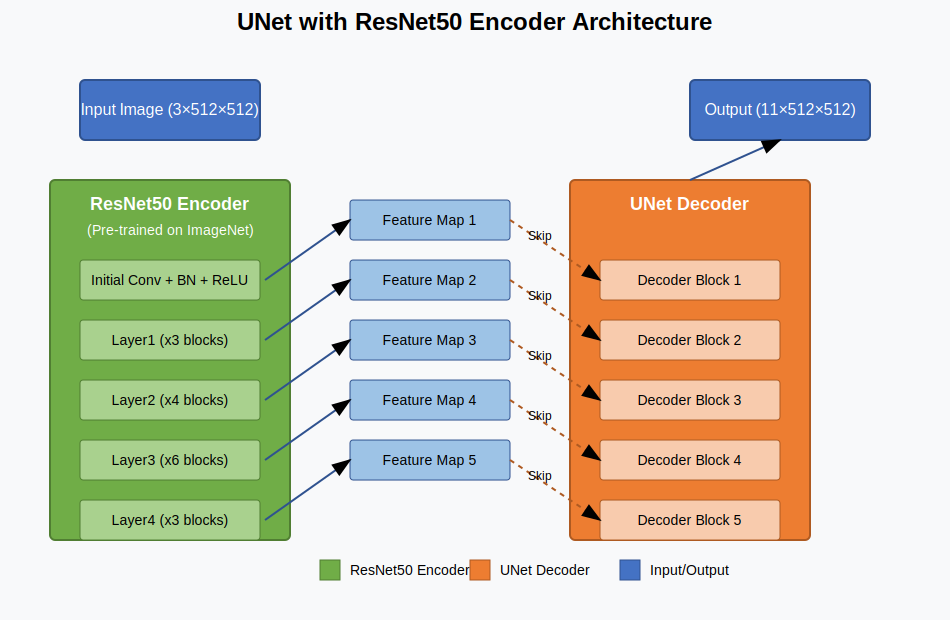
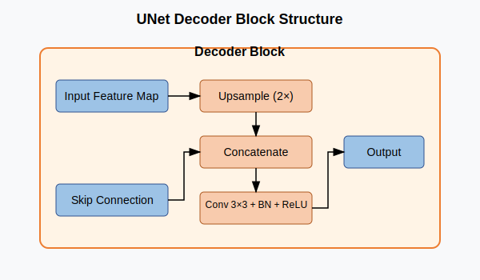

# Panoptic Segmentation of Nuclei in Melanoma - Final Project

This repository contains the completed code, model, and evaluation results for the panoptic segmentation of nuclei in melanoma histopathology images. We implemented a UNet architecture with ResNet50 encoder to identify and classify different types of cell nuclei.

## Table of Contents
- [Team Contribution](#team-contribution)
- [Network Architecture](#network-architecture)
- [Results](#results)
- [Dataset and Model](#dataset-and-model)
- [How to Run](#how-to-run)

## Team Contribution

| Team Member | Contributions |  
|-------------|---------------|  
| Md. Shakib Shahariar Junayed | Handled data preprocessing, including mask generation from GeoJSON and overall dataset preparation. Contributed to the model implementation and training script development. |  
| Muhammad Zubair | Worked on data preparation and augmentation techniques. Assisted with model evaluation and testing pipeline. |  
| Tamim Ishrak Sanjid | Focused on model architecture design, implemented UNet with ResNet50 backbone, and fine-tuned hyperparameters. Led the model training process. |  
| MD. Sakib Sami | Developed the data augmentation pipeline, conducted model evaluation, and carried out extensive testing. Created visualizations for result interpretation. |  
| Sanjida Akter Shorna | Contributed to data preparation, implemented loss functions, and assisted with result analysis. |

## Network Architecture

Our solution implements a UNet architecture with a ResNet50 encoder pre-trained on ImageNet. This architecture combines the strong feature extraction capabilities of ResNet50 with UNet's precise localization through skip connections.

### Overall Architecture



The architecture consists of:
- **ResNet50 Encoder**: Pre-trained on ImageNet, provides rich feature hierarchies
- **Skip Connections**: Preserve spatial information lost during downsampling
- **UNet Decoder**: Progressively upsamples features while incorporating details from skip connections
- **Final Layer**: Produces an 11-channel output (10 cell types + background)

### Decoder Block Detail



Each decoder block:
1. Upsamples the input features by 2×
2. Concatenates with corresponding skip connection features
3. Applies convolution, batch normalization, and ReLU activation
4. Produces feature maps for the next decoder block or final output

### Training Configuration:

- **Optimizer:** Adam (lr=1e-4, weight_decay=1e-5)
- **Training Strategy:** Gradient accumulation (4 steps)
- **Mixed Precision:** Used to improve training efficiency
- **Epochs:** 25
- **Batch Size:** 4
- **Input Size:** 512 × 512 pixels

## Results

### Training Progress

Our model training showed significant improvement over 25 epochs. Below are the key metrics tracked during training:

| Epoch | Training Loss | Training Accuracy | Validation Loss | Validation Accuracy | Validation F1-Score |
|-------|---------------|-------------------|-----------------|---------------------|---------------------|
| 1     | 0.9450        | 0.7455            | 0.6857          | 0.8745              | 0.1518             |
| 5     | 0.5322        | 0.9174            | 0.5059          | 0.9103              | 0.2886             |
| 10    | 0.3466        | 0.9451            | 0.4782          | 0.9141              | 0.3992             |
| 15    | 0.3031        | 0.9505            | 0.4931          | 0.9159              | 0.3842             |
| 20    | 0.2754        | 0.9528            | 0.5054          | 0.9155              | 0.3942             |
| 25    | 0.2582        | 0.9603            | 0.5117          | 0.9181              | 0.3770             |

### Final Performance Metrics

After 25 epochs of training, our model achieved the following final results on the validation dataset:

- **Validation Accuracy:** 0.9181
- **Validation Precision:** 0.4918 (macro average)
- **Validation Recall:** 0.3474 (macro average)
- **Validation F1-Score:** 0.3770 (macro average)

The model demonstrates strong overall accuracy due to good background class detection, while specific nuclei classes present varying levels of challenge. We observed that abundant cell types like tumor nuclei and lymphocytes were detected with better precision compared to rarer cell types.

### Training Observations

The training metrics show consistent improvement throughout the training process with:
- Training accuracy increasing from 74.55% to 96.03%
- Training loss decreasing from 0.9450 to 0.2582

The validation metrics stabilized around epoch 10, suggesting that the model reached a good balance between underfitting and overfitting. While the validation loss remained relatively stable in later epochs (around 0.51-0.52), the high accuracy indicates that the model performs well on this segmentation task.

## Dataset and Model

- **Dataset:** The dataset contains histopathology images of melanoma with annotated nuclei of different cell types. The dataset is collected from here: [Full Data Link](https://puma.grand-challenge.org/dataset/)
- **Model:** Due to the large size of the trained model file, it has been uploaded to Google Drive. You can access it using the following link:
  [Download Model](https://drive.google.com/file/d/1wdGFYMGsaau3QGiPM5Mff45DVq6j6F7J/view?usp=sharing)
- **Sample Dataset:** A portion of the dataset is uploaded to Google Drive: [Dataset Link](https://drive.google.com/drive/folders/15mGfGGgOxnZntiWyD3r_vwLWg9V6ls8i?usp=sharing)

## How to Run

1. **Folder Structure of Final Project**
   - Download only the sample dataset and model from the provided Google Drive link
   - Extract and organize as follows:
    ```
     Final-Project/
     ├── 01_training_dataset_tif_ROIs/
     │   ├── training_set_metastatic_roi_001.tif
     │   ├── training_set_metastatic_roi_002.tif
     │   ├── ...
     │   └── training_set_metastatic_roi_0015.tif
     ├── 01_training_dataset_geojson_nuclei/
     │   ├── training_set_metastatic_roi_001_nuclei.geojson
     │   ├── training_set_metastatic_roi_002_nuclei.geojson     
     │   ├── ...
     │   └── training_set_metastatic_roi_015_nuclei.geojson
     ├── model_checkpoint_epoch_25.pth
     ├── process.py
     ├── test.py
     ├── train.py
     ...
     ...

     ```

2. **Setup Environment:**
   ```
   pip install -r requirements.txt
   ```
   or
   ```
   conda env create -f environment.yml
   ```


3. **Process the data:**
   - Pre-Process the original dataset as the data masks is in geojson format, else it will not run perfectly.
     ```
     python process.py
     ```

3. **Training:**
   ```
   python train.py
   ```

4. **Testing:**
   ```
   python test.py --checkpoint model_checkpoint_epoch_25.pth
   ```
